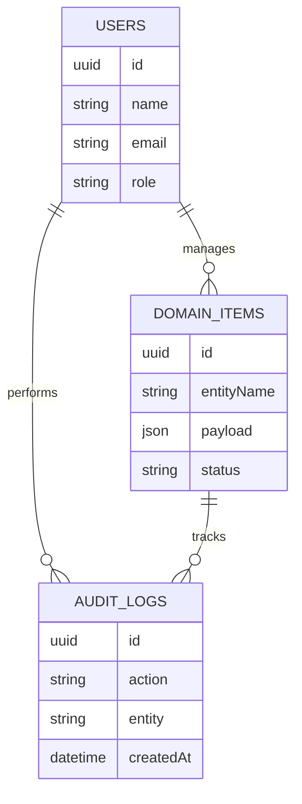

# ER Diagram

This ER diagram describes the main database relationships for Cab Booking Management System.

## Domain Mapping

The data model includes users, roles, audit logs, and domain collections for Cab Booking Customers, Cab Booking Slots, Cab Bookings, Cab Booking Payments, Cab Booking Cancellations. Key fields include Cab Booking Customers with Cab Booking Customer Code, Cab Booking Customer Name, Cab Booking Category, Booking & Reservation Management Owner, Cab Booking Customer Status, Cab Booking Customer Code, Cab Booking Phone Number, Cab Booking Email; Cab Booking Slots with Cab Booking Slot Code, Cab Booking Slot Name, Cab Booking Category, Booking & Reservation Management Owner, Cab Booking Slot Status, Cab Booking Slot Code, Cab Booking Slot Date, Cab Booking Capacity; Cab Bookings with Cab Booking Booking Code, Cab Booking Booking Name, Cab Booking Category, Booking & Reservation Management Owner, Cab Booking Booking Status, Cab Booking Booking Number, Cab Booking Booking Date, Cab Booking Booking Status; Cab Booking Payments with Cab Booking Payment Code, Cab Booking Payment Name, Cab Booking Category, Booking & Reservation Management Owner, Cab Booking Payment Status, Cab Booking Payment Number, Cab Booking Amount, Cab Booking Payment Status; Cab Booking Cancellations with Cab Booking Cancellation Code, Cab Booking Cancellation Name, Cab Booking Category, Booking & Reservation Management Owner, Cab Booking Cancellation Status, Cab Booking Cancellation Number, Cab Booking Cancellation Reason, Cab Booking Refund Amount.

## Entity Field Summary

- Cab Booking Customers: Cab Booking Customer Code, Cab Booking Customer Name, Cab Booking Category, Booking & Reservation Management Owner, Cab Booking Customer Status, Cab Booking Customer Code, Cab Booking Phone Number, Cab Booking Email
- Cab Booking Slots: Cab Booking Slot Code, Cab Booking Slot Name, Cab Booking Category, Booking & Reservation Management Owner, Cab Booking Slot Status, Cab Booking Slot Code, Cab Booking Slot Date, Cab Booking Capacity
- Cab Bookings: Cab Booking Booking Code, Cab Booking Booking Name, Cab Booking Category, Booking & Reservation Management Owner, Cab Booking Booking Status, Cab Booking Booking Number, Cab Booking Booking Date, Cab Booking Booking Status
- Cab Booking Payments: Cab Booking Payment Code, Cab Booking Payment Name, Cab Booking Category, Booking & Reservation Management Owner, Cab Booking Payment Status, Cab Booking Payment Number, Cab Booking Amount, Cab Booking Payment Status
- Cab Booking Cancellations: Cab Booking Cancellation Code, Cab Booking Cancellation Name, Cab Booking Category, Booking & Reservation Management Owner, Cab Booking Cancellation Status, Cab Booking Cancellation Number, Cab Booking Cancellation Reason, Cab Booking Refund Amount
