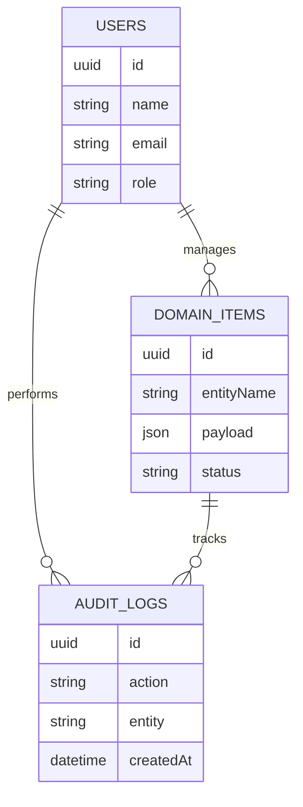
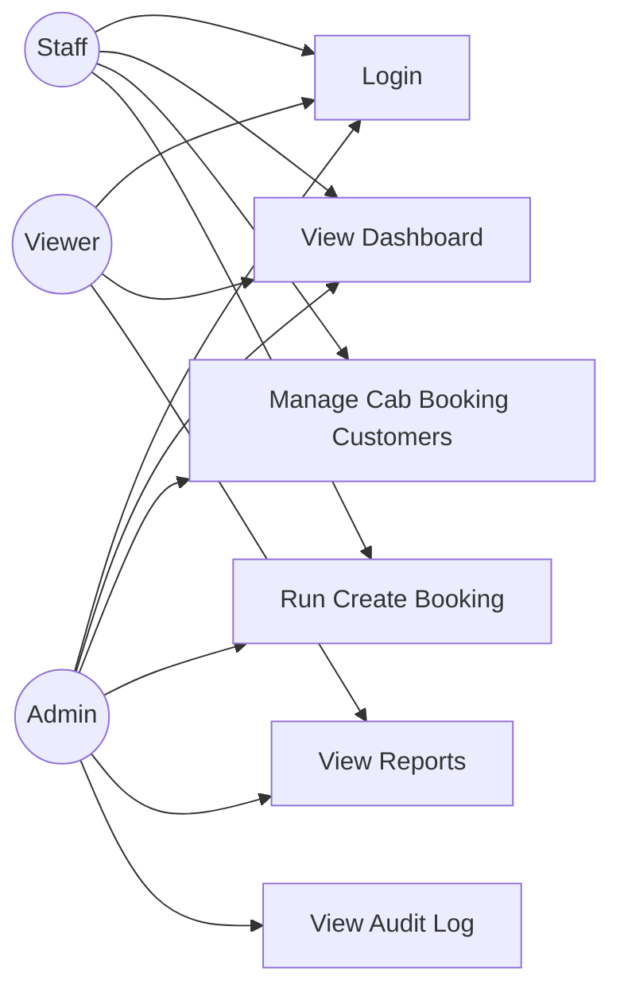
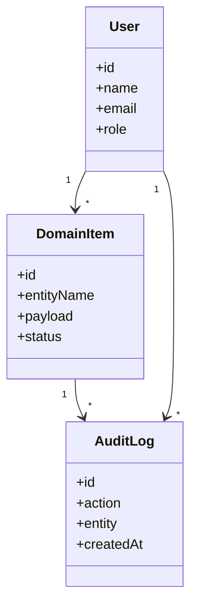
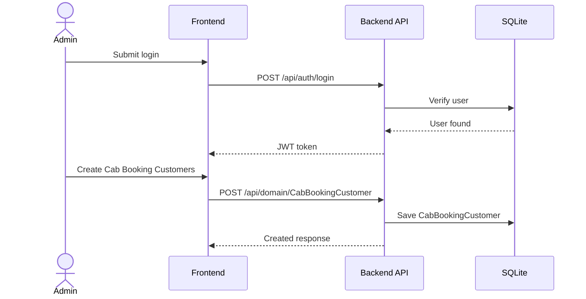

# Cab Booking Management System Project Report

Generated on 2026-04-27.

# Synopsis

## Project Title

Cab Booking Management System

## Project Category

Management

## Synopsis

Cab Booking Management System is a web-based management system designed to help users manage Cab Booking Customers, Cab Booking Slots, Cab Bookings, Cab Booking Payments, and Cab Booking Cancellations through a secure dashboard, structured CRUD workflows, reports, and audit history.

The project uses the Student Project Factory management template and adapts it for the cab booking domain. It includes domain-specific modules, sample seed data, dashboard statistics, API documentation, and demo credentials so students can run and explain the project confidently.

## Main Features

- Create Booking: Create Booking for cab booking with clear steps, ownership, and audit-ready status updates.
- Reschedule Booking: Reschedule Booking for cab booking with clear steps, ownership, and audit-ready status updates.
- Process Cancellation: Process Cancellation for cab booking with clear steps, ownership, and audit-ready status updates.

## Main Modules

- Dashboard
- Cab Booking Customers
- Cab Booking Slots
- Cab Bookings
- Cab Booking Payments
- Cab Booking Cancellations
- Create Booking
- Reschedule Booking
- Process Cancellation
- Reports
- Audit Trail

## Technology Stack

- Frontend: React + Tailwind
- Backend: Spring Boot
- Database: SQLite
- API Docs: Swagger
- Runtime: Docker Compose

## Domain Entities

- Cab Booking Customers: Cab Booking Customer Code, Cab Booking Customer Name, Cab Booking Category, Booking & Reservation Management Owner, Cab Booking Customer Status, Cab Booking Customer Code, Cab Booking Phone Number, Cab Booking Email
- Cab Booking Slots: Cab Booking Slot Code, Cab Booking Slot Name, Cab Booking Category, Booking & Reservation Management Owner, Cab Booking Slot Status, Cab Booking Slot Code, Cab Booking Slot Date, Cab Booking Capacity
- Cab Bookings: Cab Booking Booking Code, Cab Booking Booking Name, Cab Booking Category, Booking & Reservation Management Owner, Cab Booking Booking Status, Cab Booking Booking Number, Cab Booking Booking Date, Cab Booking Booking Status
- Cab Booking Payments: Cab Booking Payment Code, Cab Booking Payment Name, Cab Booking Category, Booking & Reservation Management Owner, Cab Booking Payment Status, Cab Booking Payment Number, Cab Booking Amount, Cab Booking Payment Status
- Cab Booking Cancellations: Cab Booking Cancellation Code, Cab Booking Cancellation Name, Cab Booking Category, Booking & Reservation Management Owner, Cab Booking Cancellation Status, Cab Booking Cancellation Number, Cab Booking Cancellation Reason, Cab Booking Refund Amount

## Domain Workflows

- Create Booking: Select Customer -> Choose Slot -> Capture Payment -> Confirm Booking
- Reschedule Booking: Open Booking -> Check New Slot -> Update Schedule -> Notify Customer
- Process Cancellation: Verify Booking -> Capture Reason -> Calculate Refund -> Close Booking

## Demo Access

```txt
Email: admin@example.com
Password: Admin@123
```


---

# Abstract

Cab Booking Management System is developed to simplify and digitize the daily operations of a cab booking management environment. Manual record keeping can cause delays, duplicate entries, weak reporting, and difficulty in tracking important activities. This system provides a centralized platform for managing Cab Booking Customers, Cab Booking Slots, Cab Bookings, Cab Booking Payments, and Cab Booking Cancellations with proper authentication, validation, reports, and audit logs.

The application follows a modular architecture with separate frontend, backend, and database layers. The frontend uses React + Tailwind to provide a clean student-friendly dashboard, while the backend uses Spring Boot to expose REST APIs documented through Swagger. SQLite stores structured data such as Cab Booking Customers, Cab Booking Slots, Cab Bookings, Cab Booking Payments, and Cab Booking Cancellations and configured domain workflows.

The project includes seed data based on domain records with code, title, description, and status, staff users and administrators, and Create Booking, Reschedule Booking, Process Cancellation. This makes the system easy to demonstrate during project reviews, viva sessions, and final-year submissions.


---

# Problem Statement

Organizations in the cab booking domain often manage Cab Booking Customers, Cab Booking Slots, Cab Bookings, Cab Booking Payments, and Cab Booking Cancellations using paper registers, spreadsheets, or disconnected tools. These methods become difficult to maintain as data volume increases.

## Existing Problems

- Data is scattered across multiple files or registers.
- Searching and updating Cab Booking Customers takes unnecessary time.
- Reports are prepared manually and may contain mistakes.
- Tracking Create Booking and recent activity is difficult.
- There is no consistent audit history for important changes.
- Students and administrators cannot easily demonstrate a complete digital workflow.

## Proposed Problem Solution

Cab Booking Management System solves these issues by providing a centralized web application with login, dashboard statistics, CRUD modules, reports, seed data, and documented APIs. The system is designed so that users can manage Cab Booking Customers, Cab Booking Slots, Cab Bookings, Cab Booking Payments, and Cab Booking Cancellations in a structured and reliable way.


---

# Objectives

The main objective of Cab Booking Management System is to build a complete and easy-to-understand management system for the cab booking domain.

## Primary Objectives

- Provide secure admin login and protected dashboard access.
- Manage Cab Booking Customers, Cab Booking Slots, Cab Bookings, Cab Booking Payments, and Cab Booking Cancellations using CRUD operations.
- Store all project data in SQLite.
- Provide dashboard statistics such as Total Bookings, Available Slots, Pending Payments, and Cancellations.
- Generate reports for monitoring and decision-making.
- Maintain audit logs for important user actions.
- Provide Swagger API documentation for backend testing.
- Include seed data for quick demonstration.

## Learning Objectives

- Understand full-stack project structure.
- Learn REST API design using Spring Boot.
- Practice database modeling and relationships.
- Build reusable frontend components.
- Use Docker Compose for local deployment.
- Prepare documentation required for college submission.


---

# Major Project Profile

## Project Category

Final Year Major Project

## Complexity

advanced

## Problem Depth

Cab Booking Management System is positioned as a final-year major project.

## Advanced Modules

- Advanced module enrichment not available.

## Major Workflows

- Workflow enrichment not available.

## Analytics Reports

- Analytics enrichment not available.

## Config-Driven Generation Scope

Generation mode: deterministic-config

- Domain configuration was used for modules, workflows, seed data, and documentation.

## Acceptance Tests

- Standard validation checks apply.


---

# System Requirements

## Functional Requirements

- The system shall allow admin login using demo credentials.
- The system shall display dashboard statistics for Cab Booking Management System.
- The system shall allow users to create, view, update, and delete Cab Booking Customers, Cab Booking Slots, Cab Bookings, Cab Booking Payments, and Cab Booking Cancellations.
- The system shall support searching and filtering Cab Booking Customers.
- The system shall provide reports for key project data.
- The system shall maintain audit logs for important actions.
- The system shall expose REST APIs with Swagger documentation.

## Non-Functional Requirements

- The system should be easy to run locally.
- The UI should be simple and student-friendly.
- API responses should be structured and consistent.
- The database should support project data and domain-specific seed data.
- The project should be portable through Docker Compose.
- Documentation should be clear enough for viva and submission.

## Users

- Admin
- Staff or operator
- Viewer or report user


---

# Software Requirements

## Development Software

- Node.js 20 or later
- pnpm package manager
- Docker Desktop or Docker Engine
- SQLite, provided through Docker Compose or local configuration
- VS Code, Cursor, or another code editor
- Git

## Application Software

- Frontend: React + Tailwind
- Backend framework: Spring Boot
- Database: SQLite
- API documentation: Swagger
- Authentication: JWT-based auth structure

## Browser Requirement

Any modern browser such as Chrome, Edge, Firefox, or Safari can be used to access the frontend and Swagger documentation.


---

# Hardware Requirements

## Minimum Requirements

- Processor: Dual-core processor
- RAM: 4 GB
- Storage: 2 GB free space
- Network: Localhost access for frontend, backend, and database services

## Recommended Requirements

- Processor: Quad-core processor
- RAM: 8 GB or more
- Storage: 5 GB free space
- Docker-compatible development machine

## Deployment Environment

For college demonstration, the project can run on a laptop using Docker Compose. A separate production server is not required for basic project submission.


---

# Module Description

Cab Booking Management System is divided into modules so each part of the system has a clear responsibility.

## Core Modules

- Dashboard: Shows Cab Booking Customers, Cab Booking Slots, Cab Bookings, Cab Booking Payments, and Cab Booking Cancellations statistics, insight panels, and domain workflow status.
- Cab Booking Customers: Manages cab booking customers with cab booking customer code, cab booking customer name, cab booking category, booking & reservation management owner, cab booking customer status, cab booking customer code, cab booking phone number, cab booking email.
- Cab Booking Slots: Manages cab booking slots with cab booking slot code, cab booking slot name, cab booking category, booking & reservation management owner, cab booking slot status, cab booking slot code, cab booking slot date, cab booking capacity.
- Cab Bookings: Manages cab bookings with cab booking booking code, cab booking booking name, cab booking category, booking & reservation management owner, cab booking booking status, cab booking booking number, cab booking booking date, cab booking booking status.
- Cab Booking Payments: Manages cab booking payments with cab booking payment code, cab booking payment name, cab booking category, booking & reservation management owner, cab booking payment status, cab booking payment number, cab booking amount, cab booking payment status.
- Cab Booking Cancellations: Manages cab booking cancellations with cab booking cancellation code, cab booking cancellation name, cab booking category, booking & reservation management owner, cab booking cancellation status, cab booking cancellation number, cab booking cancellation reason, cab booking refund amount.
- Create Booking: Supports workflow steps such as Select Customer, Choose Slot, Capture Payment, Confirm Booking.
- Reschedule Booking: Supports workflow steps such as Open Booking, Check New Slot, Update Schedule, Notify Customer.
- Process Cancellation: Supports workflow steps such as Verify Booking, Capture Reason, Calculate Refund, Close Booking.
- Reports: Provides summary views for Cab Booking Customers, Cab Booking Slots, Cab Bookings, Cab Booking Payments, and Cab Booking Cancellations and configured workflows.
- Audit Trail: Tracks important actions performed in the system.

## Domain Entities

- Cab Booking Customers: Cab Booking Customer Code, Cab Booking Customer Name, Cab Booking Category, Booking & Reservation Management Owner, Cab Booking Customer Status, Cab Booking Customer Code, Cab Booking Phone Number, Cab Booking Email
- Cab Booking Slots: Cab Booking Slot Code, Cab Booking Slot Name, Cab Booking Category, Booking & Reservation Management Owner, Cab Booking Slot Status, Cab Booking Slot Code, Cab Booking Slot Date, Cab Booking Capacity
- Cab Bookings: Cab Booking Booking Code, Cab Booking Booking Name, Cab Booking Category, Booking & Reservation Management Owner, Cab Booking Booking Status, Cab Booking Booking Number, Cab Booking Booking Date, Cab Booking Booking Status
- Cab Booking Payments: Cab Booking Payment Code, Cab Booking Payment Name, Cab Booking Category, Booking & Reservation Management Owner, Cab Booking Payment Status, Cab Booking Payment Number, Cab Booking Amount, Cab Booking Payment Status
- Cab Booking Cancellations: Cab Booking Cancellation Code, Cab Booking Cancellation Name, Cab Booking Category, Booking & Reservation Management Owner, Cab Booking Cancellation Status, Cab Booking Cancellation Number, Cab Booking Cancellation Reason, Cab Booking Refund Amount

## Domain Workflows

- Create Booking: Select Customer -> Choose Slot -> Capture Payment -> Confirm Booking
- Reschedule Booking: Open Booking -> Check New Slot -> Update Schedule -> Notify Customer
- Process Cancellation: Verify Booking -> Capture Reason -> Calculate Refund -> Close Booking

## Dashboard Statistics

- Total Bookings
- Available Slots
- Pending Payments
- Cancellations

## Unique Domain Features

- Create Booking: Create Booking for cab booking with clear steps, ownership, and audit-ready status updates.
- Reschedule Booking: Reschedule Booking for cab booking with clear steps, ownership, and audit-ready status updates.
- Process Cancellation: Process Cancellation for cab booking with clear steps, ownership, and audit-ready status updates.

## Seed Data Theme

- Primary Data: domain records with code, title, description, and status
- People / Owners: staff users and administrators
- Workflows: Create Booking, Reschedule Booking, Process Cancellation


---

# ER Diagram

This ER diagram describes the main database relationships for Cab Booking Management System.



## Domain Mapping

The data model includes users, roles, audit logs, and domain collections for Cab Booking Customers, Cab Booking Slots, Cab Bookings, Cab Booking Payments, Cab Booking Cancellations. Key fields include Cab Booking Customers with Cab Booking Customer Code, Cab Booking Customer Name, Cab Booking Category, Booking & Reservation Management Owner, Cab Booking Customer Status, Cab Booking Customer Code, Cab Booking Phone Number, Cab Booking Email; Cab Booking Slots with Cab Booking Slot Code, Cab Booking Slot Name, Cab Booking Category, Booking & Reservation Management Owner, Cab Booking Slot Status, Cab Booking Slot Code, Cab Booking Slot Date, Cab Booking Capacity; Cab Bookings with Cab Booking Booking Code, Cab Booking Booking Name, Cab Booking Category, Booking & Reservation Management Owner, Cab Booking Booking Status, Cab Booking Booking Number, Cab Booking Booking Date, Cab Booking Booking Status; Cab Booking Payments with Cab Booking Payment Code, Cab Booking Payment Name, Cab Booking Category, Booking & Reservation Management Owner, Cab Booking Payment Status, Cab Booking Payment Number, Cab Booking Amount, Cab Booking Payment Status; Cab Booking Cancellations with Cab Booking Cancellation Code, Cab Booking Cancellation Name, Cab Booking Category, Booking & Reservation Management Owner, Cab Booking Cancellation Status, Cab Booking Cancellation Number, Cab Booking Cancellation Reason, Cab Booking Refund Amount.

## Entity Field Summary

- Cab Booking Customers: Cab Booking Customer Code, Cab Booking Customer Name, Cab Booking Category, Booking & Reservation Management Owner, Cab Booking Customer Status, Cab Booking Customer Code, Cab Booking Phone Number, Cab Booking Email
- Cab Booking Slots: Cab Booking Slot Code, Cab Booking Slot Name, Cab Booking Category, Booking & Reservation Management Owner, Cab Booking Slot Status, Cab Booking Slot Code, Cab Booking Slot Date, Cab Booking Capacity
- Cab Bookings: Cab Booking Booking Code, Cab Booking Booking Name, Cab Booking Category, Booking & Reservation Management Owner, Cab Booking Booking Status, Cab Booking Booking Number, Cab Booking Booking Date, Cab Booking Booking Status
- Cab Booking Payments: Cab Booking Payment Code, Cab Booking Payment Name, Cab Booking Category, Booking & Reservation Management Owner, Cab Booking Payment Status, Cab Booking Payment Number, Cab Booking Amount, Cab Booking Payment Status
- Cab Booking Cancellations: Cab Booking Cancellation Code, Cab Booking Cancellation Name, Cab Booking Category, Booking & Reservation Management Owner, Cab Booking Cancellation Status, Cab Booking Cancellation Number, Cab Booking Cancellation Reason, Cab Booking Refund Amount


---

# UML Diagrams

## Use Case Diagram



## Class Diagram



## Sequence Diagram




---

# API Documentation

The backend exposes REST APIs for Cab Booking Management System. Swagger documentation is available at:

```txt
http://localhost:18080/api/docs
```

## Authentication

| Method | Endpoint | Purpose |
| --- | --- | --- |
| POST | `/api/auth/login` | Login and receive an access token |

## Common APIs

| Method | Endpoint | Purpose |
| --- | --- | --- |
| GET | `/api/health` | Check backend health |
| GET | `/api/dashboard/stats` | Fetch dashboard statistics |
| GET | `/api/reports/summary` | View report summary |
| GET | `/api/audit-log` | View audit history |

## Domain APIs

| Method | Endpoint | Purpose |
| --- | --- | --- |
| GET | `/api/domain/CabBookingCustomer` | List Cab Booking Customers |
| POST | `/api/domain/CabBookingCustomer` | Create Cab Booking Customers entry |
| GET | `/api/domain/CabBookingSlot` | List Cab Booking Slots |
| POST | `/api/domain/CabBookingSlot` | Create Cab Booking Slots entry |
| GET | `/api/domain/CabBookingBooking` | List Cab Bookings |
| POST | `/api/domain/CabBookingBooking` | Create Cab Bookings entry |
| GET | `/api/domain/CabBookingPayment` | List Cab Booking Payments |
| POST | `/api/domain/CabBookingPayment` | Create Cab Booking Payments entry |
| GET | `/api/domain/CabBookingCancellation` | List Cab Booking Cancellations |
| POST | `/api/domain/CabBookingCancellation` | Create Cab Booking Cancellations entry |

## Demo Login

```json
{
  "email": "admin@example.com",
  "password": "Admin@123"
}
```


---

# Test Cases

| Test Case ID | Scenario | Steps | Expected Result |
| --- | --- | --- | --- |
| TC-001 | Admin login | Enter valid demo credentials and submit | Dashboard opens successfully |
| TC-002 | Invalid login | Enter wrong password and submit | Error message is displayed |
| TC-003 | View dashboard | Login and open dashboard | Statistics for Total Bookings, Available Slots, Pending Payments, and Cancellations are shown |
| TC-004 | Create CabBookingCustomer | Open Cab Booking Customers page and submit valid form | New CabBookingCustomer entry is created |
| TC-005 | Edit record | Update an existing Cab Booking Customers item | Updated values are saved |
| TC-006 | Delete record | Delete an existing item after confirmation | Item is removed or marked inactive |
| TC-007 | Search Cab Booking Customers | Search by domain fields | Matching Cab Booking Customers are displayed |
| TC-008 | View reports | Open reports page | Summary report loads correctly |
| TC-009 | Swagger check | Open `/api/docs` | Swagger documentation is visible |
| TC-010 | Health check | Call `/api/health` | API returns healthy status |

## Domain-Specific Test Focus

The tester should verify that seed data correctly represents domain records with code, title, description, and status, staff users and administrators, and Create Booking, Reschedule Booking, Process Cancellation.


---

# Future Scope

Cab Booking Management System can be extended with more advanced features after the base project is complete.

## Possible Enhancements

- Add role-based permissions for each module.
- Add advanced analytics and charts.
- Add PDF and Excel export for reports.
- Add email or SMS notifications.
- Add file upload support for documents and receipts.
- Add multi-branch or multi-location support.
- Add mobile-friendly progressive web app behavior.
- Add automated backups for SQLite.
- Add approval workflows for important Create Booking actions.

## Domain-Specific Enhancements

- Create Booking: Create Booking for cab booking with clear steps, ownership, and audit-ready status updates.
- Reschedule Booking: Reschedule Booking for cab booking with clear steps, ownership, and audit-ready status updates.
- Process Cancellation: Process Cancellation for cab booking with clear steps, ownership, and audit-ready status updates.


---

# Conclusion

Cab Booking Management System provides a complete full-stack management project for the cab booking domain. It solves common problems related to manual record keeping, slow searching, weak reporting, and lack of centralized data.

The system includes secure login, dashboard statistics, CRUD modules, reports, audit logs, seed data, API documentation, and Docker-based setup. The project also helps students understand frontend development, backend APIs, database design, authentication, deployment, and project documentation.

Overall, Cab Booking Management System is suitable for college demonstrations, viva preparation, and final-year project submission because it combines practical domain features with a clear and explainable technical architecture.

