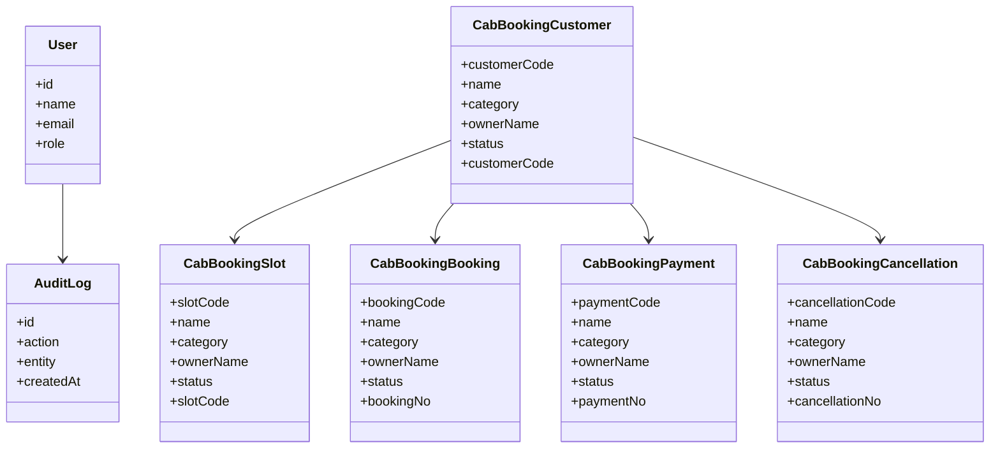

# Class Diagram

```mermaid
classDiagram
  class User {
    +id
    +name
    +email
    +role
  }
  class CabBookingCustomer {
    +customerCode
    +name
    +category
    +ownerName
    +status
    +customerCode
  }
  class CabBookingSlot {
    +slotCode
    +name
    +category
    +ownerName
    +status
    +slotCode
  }
  class CabBookingBooking {
    +bookingCode
    +name
    +category
    +ownerName
    +status
    +bookingNo
  }
  class CabBookingPayment {
    +paymentCode
    +name
    +category
    +ownerName
    +status
    +paymentNo
  }
  class CabBookingCancellation {
    +cancellationCode
    +name
    +category
    +ownerName
    +status
    +cancellationNo
  }
  class AuditLog {
    +id
    +action
    +entity
    +createdAt
  }
  CabBookingCustomer --> CabBookingSlot
  CabBookingCustomer --> CabBookingBooking
  CabBookingCustomer --> CabBookingPayment
  CabBookingCustomer --> CabBookingCancellation
  User --> AuditLog
```
